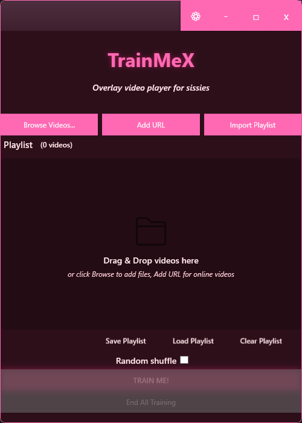

# TrainMeX


**TrainMeX** is a specialized multi-screen video playback tool designed for immersive environments, therapy sessions, and installation art. It allows you to overlay video playback on specific monitors with independent opacity and audio controls, creating a seamless background experience without interfering with your primary workspace.



## Table of Contents
- [Features](#features)
- [Use Cases](#use-cases)
- [Quick Start](#quick-start)
- [Installation](#installation)
- [Supported Websites](#supported-websites)
- [Usage Guide](#usage-guide)
- [Building from Source](#building-from-source)
- [Contributing](#contributing)
- [License](#license)

## Features

- **Multi-Monitor Support**: Assign videos to specific screens or span them across all monitors.
- **Independent Controls**: Adjust volume and opacity per video/layer.
- **Panic Button**: Instantly stop all playback with a global hotkey (Default: `Ctrl+Shift+End`).
- **Session Saving**: Automatically restores your last playlist and settings.
- **Format Support**: Plays MP4, MKV, WebM, AVI, MOV, WMV, MPEG, and more - any format supported by Windows Media Foundation.
- **URL Import**: Import videos directly from supported websites or use direct video URLs.
- **Stealth Mode**: Designed to run as an unobtrusive overlay.

## Use Cases

- **Exposure Therapy**: Gradually introduce visual stimuli on secondary screens while maintaining a safe primary focus.
- **Media Installations**: Synchronize video loops across multiple displays for art exhibits or lobbies.
- **Focus Environments**: Play ambient visual noise or nature scenes on peripheral monitors to improve concentration.
- **Vjing / Live Performance**: Simple, reliable video triggering for background visuals.

## Quick Start

1. **Download**: Grab the latest `TrainMeX.exe` from the [Releases](https://github.com/experiment-peepo/TrainMe/releases) page.
2. **Run**: Double-click `TrainMeX.exe`. No installation needed.
3. **Add Content**: Drag and drop video files onto the launcher.
4. **Assign**: Select which monitor each video should play on.
5. **Play**: Click **Train Me!** (or "Start All") to begin playback.

## Installation

TrainMeX is a **portable application**.
- **Prerequisites**: Windows 10/11 (x64).
- **Setup**: None. Just unzip and run.

## Supported Websites

TrainMeX can automatically extract and import videos from the following websites:

- **Hypnotube** (hypnotube.com)
- **Iwara** (iwara.tv)
- **PMVHaven** (pmvhaven.com)
- **RULE34Video** (rule34video.com)

You can also use **direct video URLs** from any website (URLs ending in `.mp4`, `.mkv`, `.avi`, `.mov`, `.wmv`, `.m4v`, `.webm`).

## Usage Guide

### The Launcher
The main window acts as your control center.
- **Browse / Drag & Drop**: Add files to your playlist.
- **Assignment Dropdown**: Choose the target monitor for each video.
- **Opacity Slider**: detailed control over video transparency (0% = invisible, 100% = fully opaque).
- **Volume Slider**: Individual audio levels.

### During Playback
- **Active Players**: You'll see a small list of active video windows in the launcher.
- **Control**: You can Pause, Play, or Skip videos directly from the launcher without disturbing the fullscreen playback.
- **Panic Key**: Hit `Ctrl+Shift+End` (configurable in settings) to immediately kill all video windows.

## Building from Source

To build TrainMeX yourself, you'll need the **.NET 8.0 SDK**.

1. **Clone the repo**
   ```bash
   git clone https://github.com/experiment-peepo/TrainMe.git
   cd TrainMe
   ```

2. **Build and Publish (PowerShell)**
   ```powershell
   .\publish.ps1
   ```
   *This script runs the tests and produces a single-file executable in the `publish/` folder.*

## Contributing

We welcome contributions!
- **Bug Reports**: Please use the [Bug Report Template](.github/ISSUE_TEMPLATE/bug_report.md).
- **Feature Requests**: Use the [Feature Request Template](.github/ISSUE_TEMPLATE/feature_request.md) for new ideas.

## License

Distributed under the [GNU General Public License v3.0](LICENSE). See `LICENSE` for more information.
